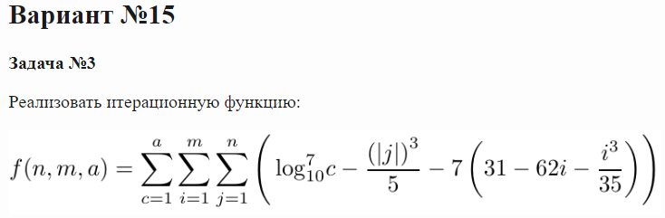

# <https://kispython.ru/>

## Задача 1


```py
main(-0.99, -0.76, 0.98) # ≈ -5.21e+00
main(0.66, 0.39, 0.23) # ≈ -6.91e+01
main(-0.19, -0.74, -0.0) # ≈ -1.23e+02
main(0.92, -0.05, -0.13) # ≈ -4.21e+00
main(-0.41, -0.51, -0.33) # ≈ -8.91e+01
```

***

## Задача 2


```py
f(281) # = 1.18e+244
f(242) # = 3.43e+09
f(173) # = 8.96e+08
f(155) # = 5.77e+08
f(302) # = 7.59e+14
```

***

## Задача 3



```py
f(5, 3, 4) # ≈ 3.87e+04
f(3, 5, 2) # ≈ 3.27e+04
f(6, 5, 2) # ≈ 6.48e+04
f(2, 5, 6) # ≈ 6.56e+04
f(4, 7, 4) # ≈ 1.72e+05
```

***

## Задача 4


```py
f(8) ≈ -5.81e-15
f(4) ≈ -5.31e-08
f(1) ≈ -8.84e-03
f(2) ≈ -1.61e-04
f(5) ≈ -9.66e-10
```

***

## Задача 5


```py
f([-0.5, 0.05, -0.77, -0.63, 0.72],
[0.62, 0.06, 0.6, 0.45, 0.73],
[-0.13, -0.71, -0.14, -0.96, 0.79]) ≈ 1.23e+02

f([-0.28, 0.2, 0.93, -0.29, -0.39],
[0.04, 0.05, 1.0, 0.23, 0.59],
[0.31, 0.36, -0.5, 0.22, -0.8]) ≈ 8.97e+01

f([0.67, -0.87, -0.68, 0.6, 0.47],
[0.79, 0.23, 0.61, 0.14, 0.88],
[0.68, 0.88, 0.1, -0.74, 0.91]) ≈ 1.36e+02

f([0.34, 0.04, 0.23, 0.58, -0.52],
[0.19, 0.45, 0.98, 0.3, 0.76],
[-0.36, 0.5, -0.1, -0.42, -0.58]) ≈ 1.31e+02

f([0.82, -0.24, -0.35, 0.68, 0.42],
[0.92, 0.56, 0.6, 0.9, 0.21],
[0.91, 0.81, 0.81, -0.74, 0.16]) ≈ 1.65e+02
```

***

## Задача 6


```py
main({1, 4, 5, 43, 15, -76, -10, 25, 92, -35}) = 47
main({4, 38, 9, -19, 78, -49, 17, 50, 84}) = 28
```

***

## Задача 7


```py
main([1970, 'ABNF', 'LSL', 'FLUX', 'TERRA']) = 10
main([1970, 'LLVM', 'SMALI', 'FLUX', 'ABAP']) = 9
main([2020, 'COBOL', 'SMALI', 'XSLT', 'TERRA']) = 0
main([1970, 'ABNF', 'LSL', 'XSLT', 'CLEAN']) = 6
main([1970, 'COBOL', 'APL', 'XSLT', 'ABAP']) = 3
```

***

## Задача 8


```py
main('105914617'), '= 0x401cbca'
main('25746216'), '= 0x2363145'
main('133434880'), '= 0x51cfc00'
main('34925427'), '= 0x536439e'
```

***

## Задача 9


```py
#Пример 1

#Входная строка:

#||.begin val enla ={q(anin_326), q(usin), q(rein_679),q(vebi) }.
# .end. .begin val rexe_403= {
# q(bisoin_353),q(aesraan_464),q(inin_832)}. .end. ||
# Разобранный результат:

{'enla': ['anin_326', 'usin', 'rein_679', 'vebi'],
 'rexe_403': ['bisoin_353', 'aesraan_464', 'inin_832']}
# Пример 2

# Входная строка:

# || .begin val laen_691 = { q(ale_292) , q(inties_358) ,
# q(quvebi_976)}. .end. .begin val anla = { q(bima_65) ,
# q(gesoxe),q(soteed_123) ,q(edzave_581) }. .end. .begin val esbe =
# {q(ain) ,q(isesce_468) }. .end. .begin val leza_378 = { q(teribi)
# ,q(biatti_207) }. .end. ||
# Разобранный результат:

{'laen_691': ['ale_292', 'inties_358', 'quvebi_976'],
 'anla': ['bima_65', 'gesoxe', 'soteed_123', 'edzave_581'],
 'esbe': ['ain', 'isesce_468'],
 'leza_378': ['teribi', 'biatti_207']}
```

***

## Задача 10


```py
###### example 1
# from
[
  [None, "99-02-15|Антон Н. Тагоцман", "+7(469)061-55-19", None, "+7(469)061-55-19"],
  [None, "02-07-15|Ильдар Е. Неренук", "+7(303)569-59-96", None, "+7(303)569-59-96"],
  [None, "02-07-20|Георгий К. Нирич", "+7(861)727-59-95", None, "+7(861)727-59-95"],
  [None, "00-10-27|Семен Г. Зовисук", "+7(740)286-06-76", None, "+7(740)286-06-76"],
]
# to
[
  ["Антон Тагоцман", "Ильдар Неренук", "Георгий Нирич", "Семен Зовисук"],
  ["469-061-5519", "303-569-5996", "861-727-5995", "740-286-0676"],
  ["99/02/15", "02/07/15", "02/07/20", "00/10/27"]
]
```

***

## Задача 11


В примерах ниже функция main возвращает объект созданного класса. Далее последовательно вызываются методы полученного объекта.

```py
# Пример 1
o = main()
o.fill() # 0
o.dash() # 1
o.fill() # 3
o.slur() # 6
o.slur() # 7
o.slur() # 9
o.slur() # 2
o.dash() # 1
o.dash() # 4
o.fill() # 8
o.fill() # 10
o.slur() # 11
o.slur() # 6
o.dash() # MealyError
o.slur() # 7

#Пример 2
o = main()
o.fill() # 0
o.dash() # 1
o.dash() # 4
o.slur() # 9
o.slur() # 2
o.fill() # MealyError
o.dash() # 1
o.slur() # 5
o.slur() # 11
o.slur() # 6
o.slur() # 7
o.fill() # 8
o.fill() # 10
```

***

## Задача 12


```py
# Пример 1
binary = (b'AWFL\x1f\x00\x00\x00\x03\x00?\x00\x02\x00\x00\x00K\xcf\x9aS=\xf1\x8bl'
 b'\xc1-\x03\xcb\xd6\xbe9\xbd\x0f\xa1\x9c\xb6\xbd\x00\x02\x00\x00\x00M\x00'
 b"O\x00\x00\x00\x02\x00f'\x02\xe2~\\\xa7\x00\x9e\x0e_2\xd9\x00\x00\x003\x00"
 b'\x00\x007\x00\x00\x00;lsQ*\xceR^n\xbdk^\xdf\xfc\xa8@\x8fy\xa8ofw\x01er\x1f'
 b'\x11<6\xbf')

parsed = {
       'A1': [
              {'B1': 9986, 'B2': 57982},
              {'B1': 23719, 'B2': 158},
              {'B1': 3679, 'B2': 13017}
       ],
       'A2': 'ls',
       'A3': 53146,
       'A4': 5998215859854716163,
       'A5': -53,
       'A6': {
              'C1': -692176451,
              'C2': 15,
              'C3': 2711402173,
              'C4': [81, 42]
       },
       'A7': {
              'D1': -50,
              'D2': 1381920445,
              'D3': 7736867486116646777,
              'D4': -22417,
              'D5': 7383371649315180860
       },
       'A8': [54, 191]
}

# Пример 2
binary = (b'AWFL\x1f\x00\x00\x00\x03\x00?\x00\x02\x00\x00\x00Ka\xd9E\xc9\xdd#y'
 b'-\xb6\x0e\xf9\x14\x1f\xed\x9d\x12\xd7\xa1\xc1\x88\x00\x02\x00\x00\x00M\x00'
 b'O\x00\x00\x00\x02\x00f\xff\xdc\x1c>\xf5#Q\xf4\xca\x1a\xe7\x9f\x00'
 b'\x00\x003\x00\x00\x007\x00\x00\x00;tx\t\t\xe4\xee\xc3\xbcU\xa4^\xf2\xd0'
 b'\x8f0\xbd\xe9\xea\x9d\xc6(\xe0\x81p\x87=$\xb8\xf2')

parsed = {
       'A1': [
              {'B1': 65500, 'B2': 7230},
              {'B1': 62755, 'B2': 20980},
              {'B1': 51738, 'B2': 59295}
       ],
       'A2': 'tx',
       'A3': 25049,
       'A4': 5028793603362502158,
       'A5': -7,
       'A6': {
              'C1': 337636765,
              'C2': 18,
              'C3': 3617702280,
              'C4': [9, 9]
       },
       'A7': {
              'D1': -28,
              'D2': -289162155,
              'D3': -6602573026109112855,
              'D4': -5475,
              'D5': 14278909465121471780
       },
       'A8': [184, 242]
}
```

